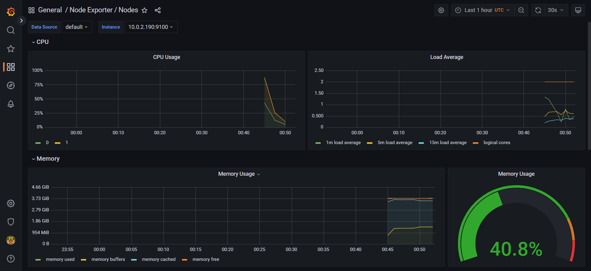

# Quick Links
* [Repo Overview](#jenkins-cicd-pipeline-for-wordpress)
* [Screenshots](#screenshots)
  - [Logging](#logging-elastic-stack)
  - [Monitoring](#monitoring-prometheus-and-grafana)
  - [Jenkins](#jenkins)
  - [SonarQube](#sonarqube)
  - [Trivy](#trivy)
* [Usage](#how-to-use-it)

# Jenkins CI/CD Pipeline for Wordpress
- This repo contains the source for a Jenkins CI/CD Pipeline that integrates and deploys WordPress on AWS EKS with **monitoring**, **logging**, **static application security testing**, and **container vulnerability scanning**
- The pipeline script builds a container image of our custom WordPress installation using Docker.
- Then it pushes the image to Docker Hub.
- Then it provisions an EKS Kubernetes cluster on AWS using Terraform.
- After that, it creates a Let's Encrypt SSL Certificate still using Terraform.
- Sensitive data are passed to the cluster by converting Ansible Jinja2 template files to regular files while passing secrets to them from Ansible Vault
- Then it provisions an AWS load balancer controller on AWS using Terraform and Helm
- Afterwards, it deploys Prometheus and Grafana for monitoring using Terraform and Helm charts.
- Using Terraform and Helm again, it deploys the Elastic Stack (Elasticsearch, Logstash, Kibana, and Filebeat)
- Next, it scans the docker image for vulnerabilities using Trivy.
- Then it deploys WordPress.

# Screenshots
## Logging (Elastic Stack)

## Monitoring (Prometheus and Grafana)

## Jenkins

## SonarQube

## Trivy

# How to Use It
## ANSIBLE VARIABLES

Create the following variables in a file called secrets.yml

- db_user
- db_password
- dp_port
- email
- email_password
- mail_server
- slack_api

Then encrypt the secrets.yml file with ansible vault.

## CREATING THE S3 AND DYNAMO DB BACKEND FOR TERRAFORM

- Once the variables and sensitive information are in place, `cd` into the backend directory and adjust the `variables.tf`.
- Open the `s3.tf` file and comment out `force_destroy = true` in the `aws_s3_bucket` resource block.
- Then run `terraform init && terraform apply -auto-approve`

## CREATING THE JENKINS SERVER

- After creating Terraform backend, `cd` into the jenkins directory and adjust the `variables.tf`.
- Then run `terraform init && terraform apply -auto-approve`

## PROVISION AND DEPLOY

### JENKINS CREDENTIALS

- Create a password file; add your ansible vault password to that file.
- Then upload the file to a secret file credential with ID: `ANSIBLE_VAULT_PASSWORD_FILE`.
- Create a "Username with Password" credential with ID: `dockerhub`.
  * Enter your Docker Hub username in the username field and your password in the password field
- Create nine secret texts with IDs: 
  * AWS_ACCESS_KEY_ID
  * AWS_SECRET_ACCESS_KEY
  * TF_VAR_account_id
  * TF_VAR_db_user
  * TF_VAR_db_password
  * TF_VAR_db_port
  * TF_VAR_db_name
  * TF_VAR_arn
  * TF_VAR_email

### Values for Jenkins Credentials

  * Value for `AWS_ACCESS_KEY_ID` should be AWS access key ID 
  * Value for `AWS_SECRET_ACCESS_KEY` should be AWS secret access key
  * Value for `TF_VAR_account_id` should be AWS Account ID
  * Value for `TF_VAR_db_user` should be database username in Base64
  * Value for `TF_VAR_db_password` should be database password in Base64
  * Value for `TF_VAR_db_port` should be database port number
  * Value for `TF_VAR_db_name` should be database name
  * Value for `TF_VAR_arn` should be AWS ARN
  * Value for `TF_VAR_email` should be email address for SSL certificate

- Then Build.
